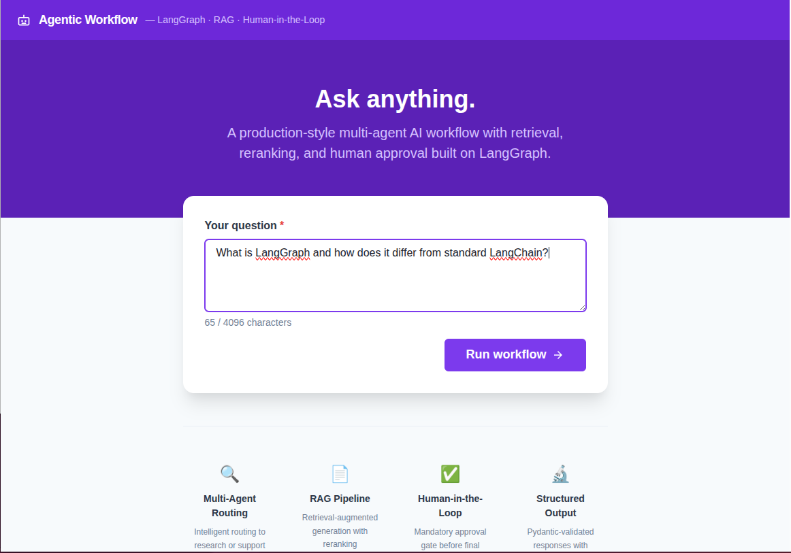
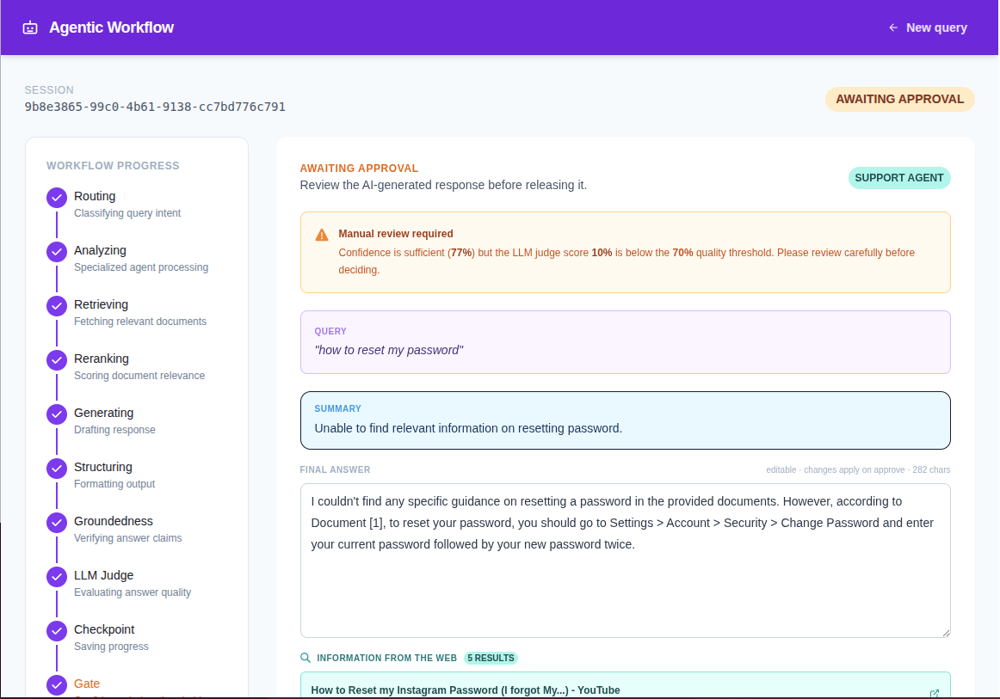
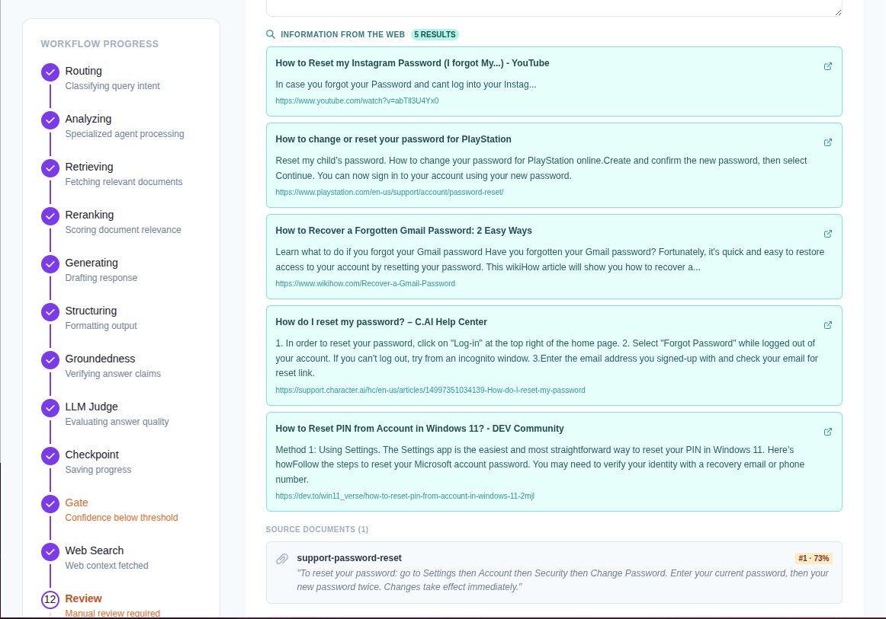
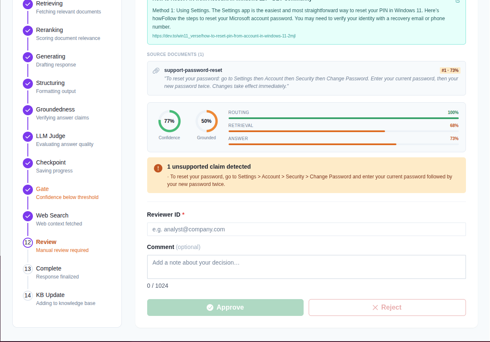
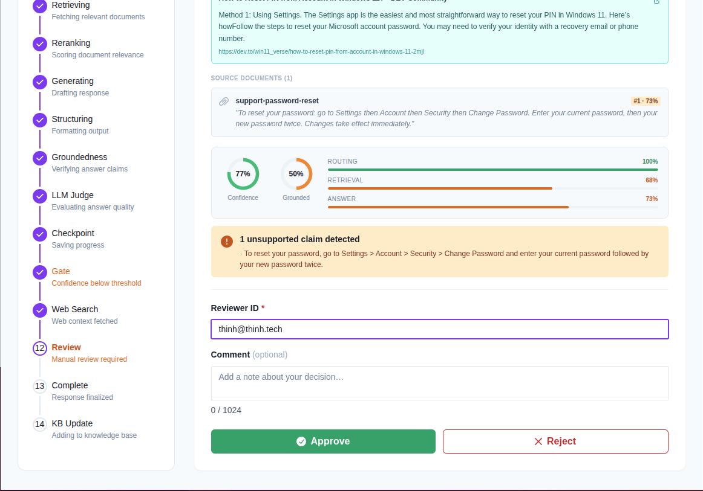
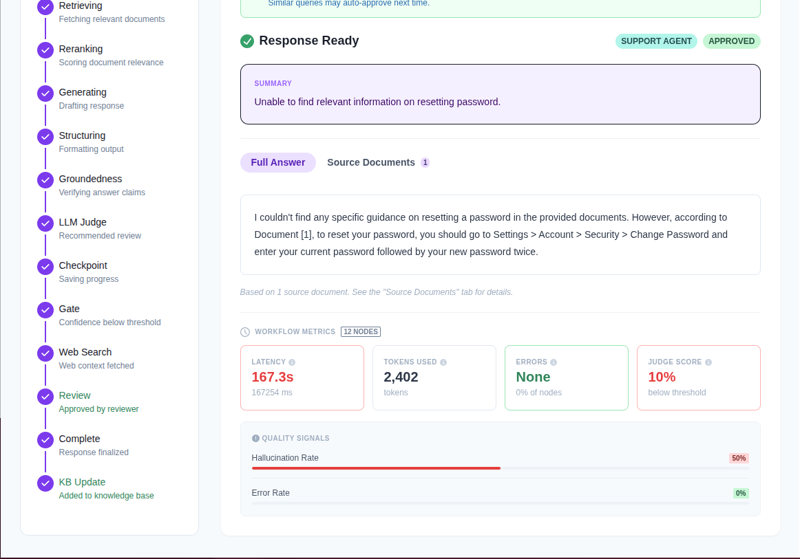
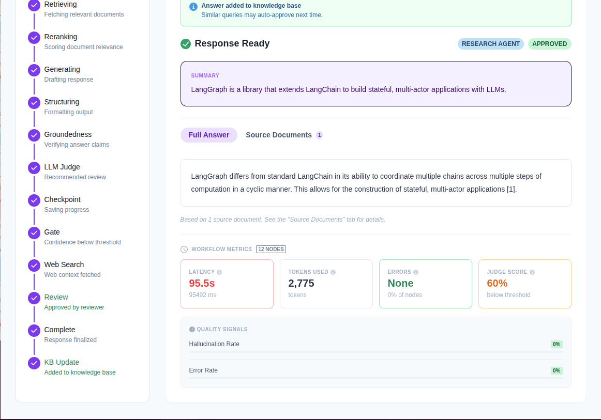
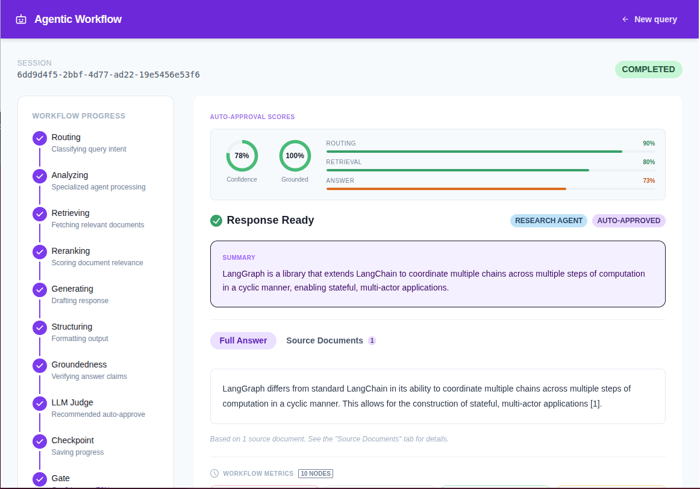
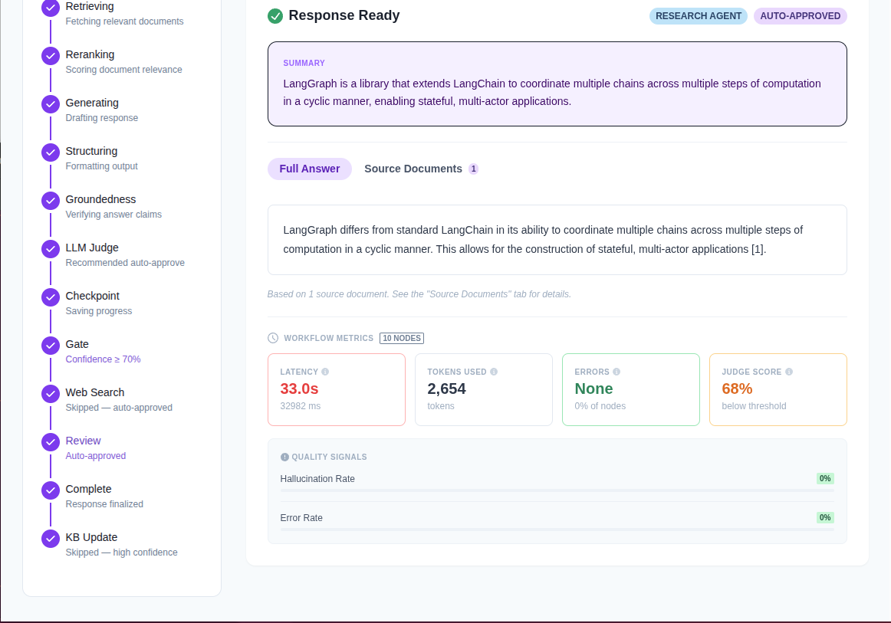
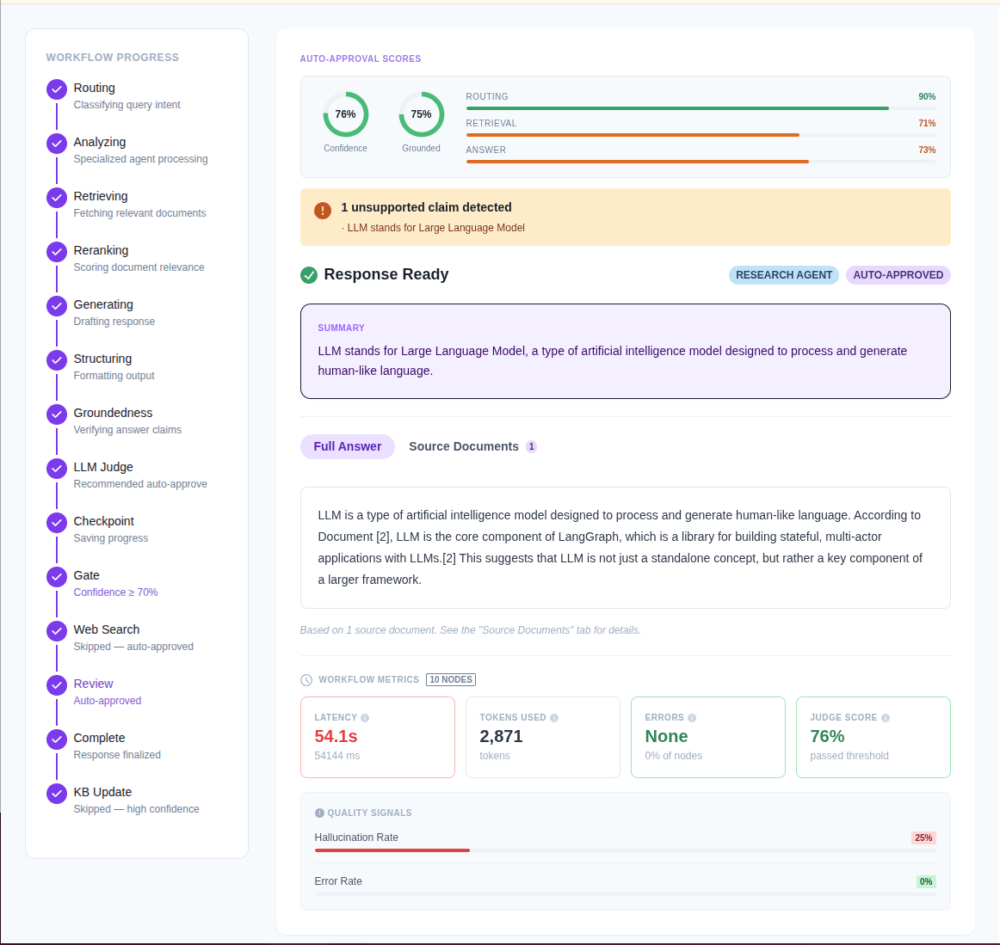

# Agentic Workflow

A production-style AI workflow that routes user queries to specialized agents, retrieves and reranks documents from agent-specific knowledge bases, generates structured answers, evaluates groundedness, and gates every response behind a human approval step.

Built to demonstrate the engineering patterns used in enterprise AI systems: multi-agent orchestration, multi-tenant RAG, LLM-as-judge evaluation, checkpointing, and human-in-the-loop control.

---

## Quick Start

```bash
# Start everything — models are downloaded and the knowledge base is seeded automatically
docker compose up --build
```

> **Environment:** a `.env` file with working defaults is already committed to the repo, so no configuration is needed to get started. If you want to customise settings (model, ports, credentials), copy `backend/.env.example` over `backend/.env` and edit as needed — or just edit `.env` directly.

> **Knowledge base:** a `seed` service runs automatically after the backend is healthy and loads sample documents into both agent collections (`research` and `support`). The seed is idempotent — re-running `docker compose up` never creates duplicates. You can add more documents via the ingest API or through the human approval step, which stores each approved Q&A pair back into the relevant collection.

Open **http://localhost:5173** and start sending queries.

---

## Screenshots

### Home — query submission

The landing page with a sample research query typed in. Feature highlights (Multi-Agent Routing, RAG Pipeline, Human-in-the-Loop, Structured Output) are shown below the input card.



---

### Awaiting approval — manual review triggered

Support Agent processed the query *"how to reset my password"*. Confidence was sufficient (77 %) but the LLM judge score (10 %) fell well below the 60 % threshold, so the workflow paused and flagged the response for human review.



---

### Approval panel — web search results

The same session scrolled to show 5 live DuckDuckGo web results fetched automatically after the gate failed, alongside the KB source document (support-password-reset, 73 % relevance). The reviewer form is visible with Approve/Reject buttons still disabled (no reviewer ID entered yet).



---

### Approval panel — confidence metrics and unsupported claim

Confidence circles (77 % confidence, 50 % grounded) with per-dimension bars. One unsupported claim is highlighted. Approve and Reject buttons remain disabled until a Reviewer ID is provided.



---

### Approval panel — reviewer ID entered, buttons active

With the Reviewer ID field filled in (`thinh@thinh.tech`), the Approve and Reject buttons become active, ready for the human decision.



---

### Completed — support agent approved by reviewer

After the reviewer clicked Approve, the response was released and the Q&A pair was added to the support knowledge base ("Added to knowledge base"). Workflow metrics: 167 s latency, 2,402 tokens, 10 % judge score (below threshold — human stepped in), 50 % hallucination rate.



---

### Completed — research agent approved, KB feedback loop

A Research Agent session ("What is LangGraph?") approved by a human reviewer. The green banner confirms the answer was ingested back into the ChromaDB collection: *"Similar queries may auto-approve next time."* Metrics: 95 s, 2,775 tokens, 60 % judge score (at threshold).



---

### Auto-approved — high-confidence research response

The same LangGraph research query on a later run reached 78 % confidence and 100 % groundedness. Both the confidence gate (≥ 70 %) and LLM judge (≥ 60 %) passed, so the workflow auto-approved with no human involved. Web Search and KB Update steps were skipped. 10 nodes, 33 s latency.



---

### Auto-approved — workflow metrics detail

Scrolled view of the same auto-approved session showing the full answer, workflow metrics card (33 s, 2,654 tokens, 68 % judge score, 0 % hallucination rate, 0 % errors), and the stepper confirming Gate passed at ≥ 70 % confidence.



---

### Auto-approved — research query with unsupported claim

Research query *"What does LLM stand for?"* auto-approved with 76 % confidence and 76 % judge score (both thresholds cleared). The groundedness checker flagged 1 unsupported claim (25 % hallucination rate), visible in the quality signals panel — demonstrating that auto-approval and claim-level grounding analysis run independently.



---

> **First run note:** `docker compose up` will download `llama3.2:latest` (~2 GB) and `nomic-embed-text` (~274 MB) automatically via the `ollama-pull` service. The backend starts only after both models are ready. This takes 5–15 minutes depending on your connection; subsequent starts are instant (models are cached in the `ollama_data` volume).

| Service | URL |
|---|---|
| Frontend | http://localhost:5173 |
| Backend API | http://localhost:8000 |
| API docs (Swagger) | http://localhost:8000/docs |
| ChromaDB | http://localhost:8001 |
| Prometheus metrics | http://localhost:8000/metrics |

---

## How It Works

Every query travels through a fixed pipeline managed by LangGraph. Each box below is a node in the state machine.

```
User Query
    │
    ▼
┌─────────┐
│  Router │  LLM classifies intent → "research" or "support"
└────┬────┘
     │
  ┌──┴──┐
  │     │
  ▼     ▼
Research  Support         (path marker nodes — set route, advance counter)
  │       │
  └───┬───┘
      │
      ▼
┌───────────┐
│ Retriever │  Queries the agent's own ChromaDB collection
└─────┬─────┘
      │
      ▼
┌──────────┐
│ Reranker │  CrossEncoder scores each chunk; keeps top 3
└────┬─────┘
     │
     ▼
┌───────────┐
│ Generator │  LLM writes answer + citations grounded in top-3 docs
└─────┬─────┘
      │
      ▼
┌──────────────────┐
│ Structured Output│  Pydantic-validates draft; computes answer confidence
└────────┬─────────┘
         │
         ▼
┌──────────────┐
│ Groundedness │  LLM extracts claims, labels each supported/unsupported
└──────┬───────┘
       │
       ▼
┌───────────┐
│ LLM Judge │  Scores faithfulness, relevance, completeness, coherence
└─────┬─────┘
      │
      ▼
┌────────────┐
│ Checkpoint │  Persists full state to PostgreSQL
└─────┬──────┘
      │
      ▼
┌──────────────────┐
│ Auto-Approval    │  overall confidence ≥ 0.70 → skip human review
│ Gate             │
└──────┬───────────┘
       │
  ┌────┴──────────────────┐
  │ auto-approved         │ manual review required
  ▼                       ▼
┌───────────────┐   ┌────────────┐
│ Final Response│   │ Web Search │  DuckDuckGo results fetched for reviewer
└───────┬───────┘   └─────┬──────┘
        │                 │
        │                 ▼
        │          ┌──────────────────┐
        │          │  Human Approval  │  Reviewer approves / rejects / edits
        │          └────────┬─────────┘
        │                   │ approved
        │                   ▼
        │          ┌────────────────┐
        └─────────►│ Final Response │
                   └───────┬────────┘
                           │
              ┌────────────┴───────────────┐
              │ manual approval only       │ auto-approved
              ▼                            ▼
    ┌──────────────────┐                 END
    │ Knowledge Update │  Stores approved Q&A back into the agent's collection
    └──────────────────┘
```

---

## Workflow Steps Explained

### 1. Router

The router is a `ChatOllama` call with `with_structured_output()`, which forces the model to return valid JSON matching this schema:

```json
{ "route": "research", "confidence": 0.95, "reasoning": "..." }
```

**How agent selection works:**

The model sees a system prompt with concrete definitions and examples for each route:

- **`research`** — analytical, conceptual, or comparative queries: *"Explain how transformer attention works"*, *"Compare SQL vs NoSQL for time-series workloads"*, *"What are best practices for microservices authentication?"*
- **`support`** — operational, how-to, or troubleshooting queries: *"How do I reset my password?"*, *"I'm getting a 500 error on the login endpoint"*, *"Is the API currently down?"*

When the intent is ambiguous, the model is instructed to prefer `research` for analytical intent and `support` for actionable/operational intent. The `confidence` score (0–1) is the model's self-reported certainty in its classification and feeds into the overall confidence calculation.

**If routing fails** (LLM error or invalid output), the graph terminates immediately via a `_route_decision` conditional edge — no documents are retrieved and no answer is generated.

---

### 2. Research Agent / Support Agent (path marker nodes)

These nodes do not call an LLM. They mark which path was taken (writing `current_node` to state) and increment the step counter. Their real purpose is to serve as named branch endpoints in the LangGraph conditional edge so the router can send queries to `"research"` or `"support"` as named destinations.

The actual agent logic runs later in the **Generator** node, where `state["route"]` decides which agent class to instantiate.

---

### 3. Retriever

The retriever embeds the user query using `nomic-embed-text` (via Ollama) and queries ChromaDB for the top-10 most similar chunks using cosine distance.

**How multi-tenant retrieval works:**

Each agent has its own isolated ChromaDB collection derived from the base collection name and the route:

```
"research"  →  knowledge_base_research
"support"   →  knowledge_base_support
```

This is implemented in `ChromaSettings.collection_for(agent_type)` and flows through `VectorStoreClient(collection_name=…)`. The retriever node reads `state["route"]` and constructs the collection name before querying:

```python
collection_name = settings.chroma.collection_for(state["route"])
service = RetrieverService(collection_name=collection_name)
```

A support query will never see documents seeded into the research collection, and vice versa. ChromaDB creates the collection automatically on first write, so no manual setup is needed.

**Retrieval confidence** is computed as a position-weighted mean of the cosine similarity scores: rank-1 is weighted 1.0×, rank-2 is 0.5×, rank-3 is 0.33×, etc. A dense, highly relevant first result produces a high score; sparse or noisy results drive it down.

---

### 4. Reranker

The reranker takes the query and all 10 retrieved chunks, scores every `(query, chunk)` pair with `BAAI/bge-reranker-large` (a CrossEncoder via `sentence-transformers`), and keeps the top 3.

CrossEncoder scoring is more accurate than cosine similarity because it sees the full query-document pair together rather than encoding them independently. The raw logits are passed through sigmoid normalisation so every score lands in (0, 1) and is directly comparable to cosine similarities.

The model is loaded once at startup (cached at class level, ~1 GB) via `asyncio.to_thread()` so it never blocks the event loop.

---

### 5. Generator

The generator dispatches to the correct agent class based on `state["route"]`:

**`ResearchAgent`** — always uses the top-3 reranked documents as context. The system prompt instructs the model to cite every factual claim with the document ID in square brackets (`[doc-id]`). A `_backfill_citations` fallback handles models that paraphrase without explicit markers.

**`SupportAgent`** — runs a two-pass approach:

1. **Triage pass**: a fast LLM call assesses whether the query can be answered from general knowledge (`faq`, `troubleshooting`, `general`) or needs the KB (`requires_context`). Returns a `can_answer_directly` flag and a `confidence` score.
2. **Generation pass**: if triage confidence is high AND no high-scoring KB documents exist (rerank ≥ 0.5), the agent answers from general knowledge with an empty citations list. If relevant KB documents exist (including previously approved Q&A), it switches to retrieval-augmented generation, grounding the answer in those documents.

Citation scores are overridden with the authoritative reranker values after generation.

---

### 6. Structured Output

Re-validates the draft JSON from the generator as a strict Pydantic schema (`StructuredOutput`). Computes `answer_confidence` as the **maximum** rerank score across the top-3 context documents — the best available evidence determines answer confidence, not the average.

---

### 7. Groundedness

A second LLM call (LLM-as-judge) extracts every factual claim from the answer and classifies each one as `supported` or `unsupported` by the source documents:

```
groundedness_score = supported_claim_count / total_claim_count
```

Using count-based scoring rather than asking the LLM for a float avoids numeric inconsistency — the hard work is binary claim classification; the aggregation is deterministic. This node is non-blocking: a failure appends to `state["errors"]` and the workflow continues to checkpoint.

---

### 8. LLM Judge

After groundedness scoring, a second LLM-as-a-judge pass evaluates the answer holistically across four weighted dimensions:

| Dimension | Weight | What it measures |
|---|---|---|
| Faithfulness | 40% | Are all claims consistent with the source documents? |
| Relevance | 30% | Does the answer actually address the user's question? |
| Completeness | 20% | Are the key aspects of the question covered? |
| Coherence | 10% | Is the response clear and well-structured? |

The weighted average becomes `overall_score` (0–1). Scores ≥ 0.70 get a `recommendation` of `"auto_approve"`; below that, `"needs_review"`. This recommendation feeds directly into the Auto-Approval Gate alongside the confidence scores.

The judge is intentionally the last quality gate before the checkpoint — by the time it runs, the answer is already validated by the groundedness node, so the judge focuses on semantic quality rather than factual support.

---

### 9. Checkpoint

Persists the full `AppState` to PostgreSQL via LangGraph's `AsyncPostgresSaver`. Every field is serialised as plain JSON, enabling complete state reconstruction after a restart or crash. This is also what makes the `interrupt_before=["human_approval"]` pause durable — the graph can resume from any machine.

---

### 10. Auto-Approval Gate

Computes the overall confidence score as a weighted combination of the three signals:

| Signal | Weight | Source |
|---|---|---|
| Router confidence | 20% | LLM self-reported classification certainty |
| Retrieval confidence | 30% | Position-weighted cosine similarity mean |
| Answer confidence | 50% | Max CrossEncoder rerank score of top-3 docs |

If `overall ≥ 0.70`, the response is auto-approved and flows directly to **Final Response** — no human review required. Below 0.70, the workflow routes to **Web Search** before pausing for a reviewer.

---

### 11. Web Search *(manual path only)*

Fetches up to 5 DuckDuckGo results for the original query using `ddgs` (via `asyncio.to_thread` to avoid blocking the event loop). Results are stored in state and surfaced in the approval panel so the reviewer has live web context alongside the AI-generated draft.

This node runs before the `interrupt_before` pause so results are already in the checkpoint when the reviewer opens the approval panel — no extra round-trip needed.

**Why a deterministic workflow node instead of tool calling or an MCP server:**

The web search could have been implemented as an LLM tool call (giving the model the ability to decide when and what to search) or exposed as an MCP server (externalising the capability entirely). Instead it is a fixed node in the LangGraph state machine — it always runs, always uses the original query, and always runs before the human approval pause.

This is the right choice here for three reasons:

1. **Predictability.** The search happens unconditionally whenever the confidence gate fails. There is no LLM deciding whether to invoke it, with what query, or how many times. The reviewer always sees web results, never sometimes.
2. **Context is for the human, not the LLM.** The search results are not fed back to the generator to improve the answer — they are surfaced directly to the reviewer so they can validate the AI's output against live information. Tool calling is designed for LLM consumption; a deterministic node is designed for workflow control.
3. **No token overhead or latency on the happy path.** Tool calling requires the LLM to emit a tool-call token sequence and then process the results in a second pass. Since web search only runs on the manual-review branch (low-confidence queries), making it a node means the auto-approval path pays zero cost for it.

---

### 12. Human Approval *(manual path only)*

LangGraph pauses at this node (`interrupt_before=["human_approval"]`) and waits for a `POST /api/v1/workflow/{id}/approve` call. The reviewer can:

- **Approve** — optionally editing the answer text before releasing it
- **Reject** — terminates the workflow (no final response delivered)

The reviewer ID and optional comment are stored in state for audit purposes.

---

### 13. Final Response

Assembles the `FinalResponse` combining the approved answer, confidence scores, groundedness evaluation, citations, and reviewer metadata. This is what `GET /api/v1/workflow/{id}/result` returns.

---

### 14. Knowledge Update *(manual approval path only)*

After a human approves a response, the approved Q&A pair is embedded and stored back into the **same agent-specific collection** that served the original retrieval:

```python
route = state.get("route")                       # e.g. "support"
collection = settings.chroma.collection_for(route)  # → "knowledge_base_support"
```

The content stored is:

```
{original query}

{approved answer}
```

This plain-prose format avoids "Question:/Answer:" labels that cause the LLM to transcribe content verbatim rather than synthesise from it. On the next identical (or semantically similar) query:

1. The retriever finds the stored document in the correct agent collection
2. The reranker gives it a high score (semantic match is very high)
3. The support/research agent generates from it → citations are populated
4. Overall confidence rises above 0.70 → the response is **auto-approved**, bypassing human review

The system becomes progressively less reliant on human review as approved Q&A accumulates in each agent's collection.

---

## LLM-as-a-Judge: Autonomous by Default, Human as Last Resort

The design philosophy of this workflow is **autonomous first** — human review is expensive, slow, and doesn't scale. The goal is to approve as many responses as possible without human involvement, while ensuring that the quality bar for auto-approved responses is high enough to trust.

Two complementary evaluators work in tandem to achieve this:

**Groundedness** (step 7) is objective and signal-based: it checks whether each individual factual claim in the answer can be traced back to a source document. A score of 1.0 means every claim is supported; 0.0 means none are. This catches hallucination at the claim level.

**LLM Judge** (step 8) is semantic and holistic: it asks whether the answer is *good* — faithful to the sources, relevant to the question, complete, and coherent. No amount of claim-level checking can tell you whether the answer actually addresses what the user asked. The judge closes that gap.

Together, these two signals feed the **Auto-Approval Gate** alongside the retrieval and routing confidence scores. When all signals are strong, the workflow delivers the answer immediately with no human in the loop. This covers the majority of queries once the knowledge base has reasonable coverage.

Human review is only triggered when the system is genuinely uncertain — low retrieval confidence, a poor judge score, or a groundedness score that reveals unsupported claims. In that case, the reviewer sees the draft answer, the confidence breakdown, the groundedness evaluation, the judge critique, and live web search results — everything needed to make an informed decision in seconds. Once approved, the Q&A pair is stored back in the knowledge base, so the same question auto-approves next time.

The result is a feedback loop: the more queries get approved, the more the knowledge base improves, the higher the confidence on future queries, and the less often humans are needed.

---

## Observability and LLM Evaluation

### What this project measures

The project exposes two distinct layers of metrics.

**Operational metrics** (Prometheus + OpenTelemetry) tell you whether the *system* is healthy:

| Metric | Where |
|---|---|
| Request latency per node (p50/p95/p99) | Prometheus histogram, `/metrics` endpoint |
| Token usage per node and per request | `token_tracker.py`, surfaced in `WorkflowMetrics` |
| Error rate per node | `errors` reducer in `AppState`, Prometheus counter |
| OTel trace per request with span-per-node | OTLP/gRPC export, visible in any OTel-compatible backend |

These answer *"is the pipeline running correctly and within SLA?"* — not *"is the answer good?"*

**Quality signals** (computed per response, shown on the frontend) tell you whether the *output* is trustworthy:

| Signal | How it is computed |
|---|---|
| Confidence score | Weighted composite of routing, retrieval, and answer confidence |
| Groundedness / hallucination rate | Claim-level: each factual claim labelled supported/unsupported against source docs |
| LLM judge score | 4-dimension holistic score: faithfulness (40 %), relevance (30 %), completeness (20 %), coherence (10 %) |
| Human approval rate | Implicit — logged on every approve/reject decision via the HITL node |

---

### Proper LLM evaluation approaches

The quality signals above are a solid start, but evaluating an LLM rigorously — especially a fine-tuned one — requires a wider toolkit.

#### 1. RAG-specific evaluation (RAGAS framework)

This project implements two of the four RAGAS pillars:

| Pillar | Measures | In this project |
|---|---|---|
| **Faithfulness** | Answer is grounded in retrieved context | ✓ groundedness node |
| **Answer Relevancy** | Answer addresses the question | ✓ judge relevance dimension |
| **Context Precision** | Retrieved chunks are on-topic | ✗ not yet |
| **Context Recall** | Retrieval captured all necessary info | ✗ not yet |

[RAGAS](https://github.com/explodinggradients/ragas) can compute all four automatically from `(question, answer, contexts, ground_truth)` tuples — the same data already available in `AppState`.

#### 2. LLM-as-a-Judge

The judge pattern used here is already a best-practice approach. Variants beyond this:

- **G-Eval** — uses chain-of-thought reasoning before scoring, tends to be better calibrated
- **MT-Bench** — multi-turn conversation quality benchmark
- **Chatbot Arena / ELO ranking** — pairwise human preference ranking; the gold standard for comparing two models or two prompt versions head-to-head

#### 3. Benchmark-based evaluation (for base or fine-tuned models)

Standard benchmarks evaluate the underlying model, not the pipeline built on top of it. Run these before and after fine-tuning to measure both improvement on the target task and any regression on general capability:

| Benchmark | What it tests |
|---|---|
| **MMLU** | Broad knowledge across 57 subjects |
| **TruthfulQA** | Resistance to hallucination on known tricky questions |
| **HellaSwag** | Commonsense reasoning |
| **GSM8K** | Math reasoning and multi-step chains |
| **HumanEval** | Code generation correctness |
| **BIG-Bench Hard** | Hard reasoning tasks that defeat most heuristics |

#### 4. Fine-tuned LLM evaluation specifically

When fine-tuning a model (SFT, LoRA, RLHF/DPO), the standard checklist is:

1. **Held-out test set with ground truth** — the most important signal. Split labelled data *before* training. After fine-tuning, compute task-specific metrics (F1 for classification, BLEU/ROUGE or LLM-judge score for generation, exact match for extraction).
2. **Delta vs. base model** — run the same eval on base and fine-tuned side-by-side. The delta is the actual gain from fine-tuning.
3. **Regression on general benchmarks** — fine-tuning on narrow data often hurts general reasoning. A drop on MMLU after a small domain fine-tune is a red flag for catastrophic forgetting.
4. **Reward model score** (for RLHF / DPO) — if preference data was used, the reward model itself is an evaluator.
5. **Human eval on edge cases** — automated metrics miss subtleties. A panel of 50–100 human-judged examples on hard or adversarial inputs is often more trustworthy than any automated score.

#### 5. What is missing from this project for a complete eval story

| Gap | How to close it |
|---|---|
| No ground truth labels | Add a `ground_truth` field to test queries; compute BERTScore or exact-match against it |
| Missing RAGAS pillars | Integrate RAGAS — it reuses `(query, answer, contexts)` already in `AppState` |
| No offline eval harness | A pytest fixture that runs N seed queries and asserts `judge_score ≥ threshold` across the batch |
| No longitudinal tracking | Log per-query scores to PostgreSQL and plot approval rate over time as the knowledge base grows |

> **Note:** the human-in-the-loop approval in this project is itself a form of human evaluation. Every approve/reject decision is a labelled quality signal. The knowledge base feedback loop means that human approval rate naturally improves over time — making it a live, self-improving eval metric that most demo projects lack entirely.

---

## Offline Evaluation Harness

An automated harness (`scripts/run_eval.py`) runs end-to-end against the live stack and reports quality metrics without any manual input.

### Quick start

```bash
# 1. Start the stack
docker compose up -d

# 2. Install eval dependencies (httpx + pyyaml; ragas is optional)
cd backend
uv sync --extra eval

# 3. Run the harness
uv run python ../scripts/run_eval.py
```

To skip RAGAS scoring (faster, no ragas package needed):

```bash
uv run python ../scripts/run_eval.py --no-ragas
```

Full options:

```
--base-url    http://localhost:8000    API base URL
--ollama-url  http://localhost:11434   Ollama base URL
--dataset     data/eval_dataset.yaml  YAML test cases
--output      data/eval_results/      Results directory
--concurrency 2                        Parallel workflow cases
--timeout     300                      Seconds per case
--no-ragas                             Skip RAGAS metrics
```

### What it measures

| Metric | Source | Notes |
|---|---|---|
| `auto_approval_rate` | pipeline gate | % of cases cleared 70% confidence AND 60% judge threshold |
| `routing_accuracy` | pipeline router | expected vs actual agent_type |
| `mean_judge_score` | LLM-as-a-judge | holistic quality (faithfulness 40%, relevance 30%, completeness 20%, coherence 10%) |
| `mean_groundedness` | groundedness node | supported claims / total claims |
| `mean_context_precision` | context_eval node | relevant retrieved docs / total retrieved docs |
| `mean_answer_similarity` | Ollama embeddings | cosine similarity of answer vs ground_truth (nomic-embed-text) |
| `mean_hallucination_rate` | pipeline | 1 − groundedness |
| `mean_latency_ms` | wall clock | end-to-end per query |
| `mean_total_tokens` | token tracker | prompt + completion tokens across all nodes |
| RAGAS faithfulness | ragas + Ollama | are all claims supported by context? |
| RAGAS answer_relevancy | ragas + Ollama | is the answer on-topic? |
| RAGAS context_precision | ragas + Ollama | are relevant chunks ranked first? |

### Dataset

`data/eval_dataset.yaml` ships with 8 calibrated test cases covering both agent types:

- **5 research cases** — LangGraph, RAG, CrossEncoder, bi-encoder vs cross-encoder comparison, RAG pipeline components
- **3 support cases** — password reset, HITL explanation, account settings navigation

Each case has a `question`, `ground_truth`, and `agent_type` (for routing accuracy).  Add cases by appending entries to the YAML file — no code changes required.

### Output

Each run writes a timestamped JSON file to `data/eval_results/eval_<timestamp>.json` containing per-case metrics and aggregate scores.  These files can be imported into any dashboard (Grafana, Jupyter, etc.) for longitudinal tracking.

---

## Multi-Tenancy

### Problem

With a single shared knowledge base and 100+ agents, every query would scan millions of documents regardless of relevance to the querying agent. Recall degrades, latency grows, and agents pollute each other's retrieval results.

### Solution: Collection-per-Agent

Each agent type gets its own isolated ChromaDB collection:

```
knowledge_base_research   ←  research queries retrieve from here
knowledge_base_support    ←  support queries retrieve from here
knowledge_base_<route>    ←  any future agent gets its own collection automatically
```

**At ingestion time** — documents are written to the agent's collection by passing `agent_type` to the ingest API:

```bash
# Research-specific document
curl -X POST http://localhost:8000/api/v1/ingest \
  -H "Content-Type: application/json" \
  -d '{
    "agent_type": "research",
    "documents": [{"content": "...", "source": "...", "metadata": {}}]
  }'

# Support-specific document
curl -X POST http://localhost:8000/api/v1/ingest \
  -H "Content-Type: application/json" \
  -d '{"agent_type": "support", "documents": [...]}'
```

Omitting `agent_type` writes to the default `knowledge_base` collection (used when no route is known, e.g. bulk imports not tied to a specific agent).

**At retrieval time** — the retriever node reads `state["route"]` and constructs the target collection name before querying:

```python
# nodes/retriever.py
collection_name = settings.chroma.collection_for(state["route"])
service = RetrieverService(collection_name=collection_name)
```

**At knowledge update time** — approved Q&A is always stored back into the same agent's collection that produced it, keeping the training signal isolated.

**Adding a new agent** requires no infrastructure change. ChromaDB creates the collection on first write. The only requirement is passing the new agent's route string through the same pipeline.

---

## Tech Stack

### AI / ML

| Component | Technology |
|---|---|
| LLM | [Ollama](https://ollama.com) — `llama3.2:latest` (default) |
| Embeddings | `nomic-embed-text` via Ollama |
| Reranker | `BAAI/bge-reranker-large` (CrossEncoder via `sentence-transformers`) |
| Orchestration | [LangGraph](https://github.com/langchain-ai/langgraph) `StateGraph` with PostgreSQL checkpointing |
| Agent framework | [LangChain](https://github.com/langchain-ai/langchain) + `ChatOllama` |

### Backend

| Component | Technology |
|---|---|
| API | FastAPI + Uvicorn |
| Validation | Pydantic v2 |
| Vector store | ChromaDB (cosine distance, collection-per-agent) |
| Persistence | PostgreSQL 16 + asyncpg + LangGraph `AsyncPostgresSaver` |
| Observability | OpenTelemetry (OTLP/gRPC traces) + Prometheus metrics |
| Logging | structlog (JSON, with OTel trace/span IDs injected) |
| Retries | tenacity (exponential backoff, 3 attempts) |
| Web search | DuckDuckGo via `ddgs` (manual approval path) |

### Frontend

| Component | Technology |
|---|---|
| Framework | React 18 + TypeScript |
| Build tool | Vite |
| UI library | Chakra UI v2 |
| Routing | React Router v6 |
| API polling | Custom `useWorkflowPoller` hook (1.5 s interval, stops at terminal states) |

### Infrastructure

| Component | Technology |
|---|---|
| Containerisation | Docker Compose (6 services: frontend, backend, postgres, chromadb, ollama, ollama-pull) |
| CI/CD | GitHub Actions (lint → test → build → push to GHCR) |

---

## Seeding the Knowledge Base

Documents must be ingested before queries return meaningful results. Use the `agent_type` field to route each document to the correct agent collection.

### Research documents

```bash
curl -X POST http://localhost:8000/api/v1/ingest \
  -H "Content-Type: application/json" \
  -d '{
    "agent_type": "research",
    "documents": [
      {
        "content": "LangGraph is a library for building stateful, multi-actor applications with LLMs. It extends LangChain with the ability to coordinate multiple chains across multiple steps of computation in a cyclic manner.",
        "source": "langgraph-docs",
        "metadata": {"topic": "AI frameworks"}
      },
      {
        "content": "Retrieval-Augmented Generation (RAG) combines information retrieval with language model generation. A retriever fetches relevant documents; the generator conditions its output on those documents, reducing hallucination and improving factual accuracy.",
        "source": "rag-overview",
        "metadata": {"topic": "AI techniques"}
      },
      {
        "content": "CrossEncoder models take a query and a document as input and output a relevance score. Unlike bi-encoders, they compare the full pair together, producing more accurate scores at the cost of higher latency. BAAI/bge-reranker-large is a popular open-source CrossEncoder.",
        "source": "reranking-guide",
        "metadata": {"topic": "information retrieval"}
      }
    ]
  }'
```

### Support documents

```bash
curl -X POST http://localhost:8000/api/v1/ingest \
  -H "Content-Type: application/json" \
  -d '{
    "agent_type": "support",
    "documents": [
      {
        "content": "To reset your password: go to Settings → Account → Security → Change Password. Enter your current password, then your new password twice. Changes take effect immediately.",
        "source": "support-password-reset",
        "metadata": {"topic": "account management"}
      },
      {
        "content": "Human-in-the-loop (HITL) workflows pause automated processes to allow a human reviewer to approve, reject, or correct AI outputs before they are acted upon. This is critical in high-stakes domains.",
        "source": "hitl-overview",
        "metadata": {"topic": "AI safety"}
      }
    ]
  }'
```

Re-ingesting the same source is safe — chunk IDs are deterministic (SHA-256) so existing entries are updated rather than duplicated.

---

## Test Queries

### Research agent (analytical / conceptual)

```
What is LangGraph and how does it differ from standard LangChain?
How does retrieval-augmented generation reduce hallucination?
Explain how CrossEncoder reranking improves retrieval quality.
What are the trade-offs between bi-encoders and cross-encoders?
```

### Support agent (operational / how-to)

```
How do I reset my password?
I'm getting a 500 error when calling the login endpoint.
What is the difference between approved and rejected workflow status?
How do I re-ingest a document without creating duplicates?
```

### Edge cases

```
AI                            # short/ambiguous — tests router fallback
What is the capital of France?  # no relevant KB docs — groundedness = 0
Can you explain and help me troubleshoot RAG pipelines?  # routing boundary
```

---

## API Reference

Full interactive docs at http://localhost:8000/docs.

### Submit a query

```bash
curl -X POST http://localhost:8000/api/v1/workflow \
  -H "Content-Type: application/json" \
  -d '{"query": "How does reranking improve retrieval quality?"}'
# → 202 Accepted  { "session_id": "..." }
```

### Poll for status

```bash
curl http://localhost:8000/api/v1/workflow/{session_id}
# status: running → awaiting_approval → completed / rejected / failed
```

### Approve or reject

```bash
curl -X POST http://localhost:8000/api/v1/workflow/{session_id}/approve \
  -H "Content-Type: application/json" \
  -d '{
    "session_id": "{session_id}",
    "action": "approved",
    "reviewer_id": "reviewer@example.com",
    "comment": "Looks accurate.",
    "edited_answer": "Optional corrected answer text"
  }'
```

### Get the final result

```bash
curl http://localhost:8000/api/v1/workflow/{session_id}/result
```

```json
{
  "session_id": "...",
  "summary": "...",
  "answer": "...",
  "citations": [
    { "document_id": "...", "source": "reranking-guide", "excerpt": "...", "relevance_score": 0.91 }
  ],
  "route": "research",
  "approval_status": "approved",
  "confidence": {
    "router": 0.95, "retrieval": 0.78, "answer": 0.88, "overall": 0.86
  },
  "groundedness": {
    "groundedness_score": 0.8333,
    "supported_claims": [...],
    "unsupported_claims": [...],
    "evaluated_at": "2025-06-09T12:00:00Z"
  }
}
```

### Ingest documents

```bash
curl -X POST http://localhost:8000/api/v1/ingest \
  -H "Content-Type: application/json" \
  -d '{
    "agent_type": "research",
    "documents": [{"content": "...", "source": "my-source", "metadata": {}}]
  }'
```

---

## Running Tests

```bash
cd backend
python -m venv .venv && source .venv/bin/activate
pip install -e ".[dev]"

# Unit tests (no infrastructure required)
pytest tests/unit -m "not integration" --override-ini="addopts="

# All tests with coverage
pytest
```

| Test module | What is covered |
|---|---|
| `test_confidence.py` | `score_retrieval` position weighting, `score_answer` (max not mean), `score_overall` weight contract |
| `test_groundedness.py` | `build_groundedness_result` score math, service delegation, node state transitions |
| `test_research_agent.py` | Citation score override, `_backfill_citations` fallback tiers |
| `test_support_agent.py` | Triage routing, direct vs retrieval-augmented path, relevant-docs threshold |
| `test_human_approval.py` | Approval state machine transitions |
| `test_observability.py` | OTel span creation, Prometheus metric recording |
| `test_checkpoints.py` (integration) | PostgreSQL checkpoint round-trip |

---

## Local Development (without Docker)

### Backend

```bash
cd backend
python -m venv .venv && source .venv/bin/activate
pip install -e ".[dev]"

# Start infrastructure only
docker compose up postgres chromadb ollama -d

# Run the API
uvicorn app.main:app --reload --port 8000
```

### Frontend

```bash
cd frontend
npm install
npm run dev   # http://localhost:5173
```

---

## Project Structure

```
.
├── backend/
│   ├── app/
│   │   ├── agents/          # router.py, research_agent.py, support_agent.py
│   │   ├── api/             # routes.py, dependencies.py
│   │   ├── checkpoints/     # PostgreSQL checkpoint models + repository
│   │   ├── core/            # config.py (ChromaSettings.collection_for), logging, exceptions
│   │   ├── evaluation/      # groundedness evaluator, schemas, service
│   │   ├── graph/
│   │   │   ├── nodes/       # one file per workflow node
│   │   │   ├── state.py     # AppState TypedDict — single source of truth
│   │   │   └── workflow.py  # StateGraph definition + compile_workflow()
│   │   ├── observability/   # OTel tracing, Prometheus metrics, middleware
│   │   ├── rag/             # embeddings, vector_store, retriever, reranker, ingestion
│   │   ├── schemas/         # Pydantic request/response models (IngestRequest.agent_type)
│   │   └── services/        # approval_service.py, confidence.py
│   └── tests/
│       ├── unit/
│       └── integration/
├── frontend/
│   └── src/
│       ├── api/             # typed fetch wrappers
│       ├── components/      # QueryForm, WorkflowStepper, ApprovalPanel, etc.
│       ├── hooks/           # useWorkflowPoller
│       ├── pages/           # HomePage, WorkflowPage
│       └── types/           # TypeScript interfaces mirroring API schemas
├── .github/workflows/
│   ├── backend.yml          # ruff lint → mypy → pytest (unit only)
│   ├── frontend.yml         # tsc --noEmit → vite build
│   └── docker.yml           # build backend + frontend images → push to GHCR
└── docker-compose.yml
```

---

## Configuration Reference

All settings are read from environment variables (or `backend/.env`).

| Variable | Default | Description |
|---|---|---|
| `OLLAMA_BASE_URL` | `http://localhost:11434` | Ollama server URL |
| `OLLAMA_DEFAULT_MODEL` | `llama3.2:latest` | Model used for routing, generation, and evaluation |
| `OLLAMA_EMBEDDING_MODEL` | `nomic-embed-text` | Embedding model |
| `OLLAMA_TIMEOUT` | `120` | Per-request timeout in seconds |
| `CHROMA_HOST` | `localhost` | ChromaDB host |
| `CHROMA_PORT` | `8001` | ChromaDB port |
| `CHROMA_COLLECTION_NAME` | `knowledge_base` | Base name; agent collections are `{base}_{agent_type}` |
| `POSTGRES_HOST` | `localhost` | PostgreSQL host |
| `POSTGRES_DB` | `agentic_workflow` | Database name |
| `POSTGRES_USER` | `postgres` | Username |
| `POSTGRES_PASSWORD` | `postgres` | Password |
| `RAG_RETRIEVAL_TOP_K` | `10` | Chunks retrieved from ChromaDB per query |
| `RAG_RERANKER_TOP_N` | `3` | Chunks kept after reranking |
| `APPROVAL_TIMEOUT_SECONDS` | `3600` | How long the workflow waits for a human decision |

---

## CI/CD

Three GitHub Actions pipelines run on every push:

| Pipeline | Triggers on | Jobs |
|---|---|---|
| `backend.yml` | `backend/**` changes | ruff lint → mypy type-check → pytest (unit, with Codecov) |
| `frontend.yml` | `frontend/**` changes | tsc type-check → vite build (artifact uploaded) |
| `docker.yml` | any push | build both Docker images; push to GHCR only on `main` |

---

## Roadmap

### Next: Fine-Tuned Local LLM

The current pipeline uses `llama3.2:latest` as a general-purpose base model for every node — routing, generation, groundedness, and judging. The natural next step is replacing (or augmenting) this with a domain-specific fine-tuned model that stays fully local via Ollama.

**Why this matters for this pipeline specifically:**

The router node is the highest-leverage target. A fine-tuned router can be a small, fast model (e.g., Llama 3.2 1B or Phi-3 mini) trained on labelled `{query → research | support}` examples. This removes the latency cost of running a 3B+ model for a binary classification that a 1B model can do in milliseconds with higher accuracy.

The generator and judge nodes are secondary targets. A fine-tuned generator trained on `{query, context → structured answer}` pairs from the knowledge base produces more consistent citation formats and fewer hallucinated claims, directly improving the groundedness and judge scores — and therefore the auto-approval rate.

**Implementation plan (stays fully local):**

1. **Collect training data** — use the `human_approval` decisions already logged to PostgreSQL. Every manually approved Q&A pair is a labelled example. After enough approvals accumulate, export via `GET /api/v1/workflow` records filtered by `approval_status = approved`.

2. **Fine-tune with Unsloth or llama.cpp** — both support LoRA fine-tuning on commodity hardware (16 GB VRAM or CPU offload). Export to GGUF format.

3. **Register in Ollama** — `ollama create my-router-v1 -f Modelfile`. The Modelfile points at the GGUF and sets the system prompt.

4. **Swap in via config** — `OLLAMA_DEFAULT_MODEL` in `docker-compose.yml` or a per-node override in `core/config.py`. No graph code changes required.

5. **Measure impact** — re-run the offline eval harness (`scripts/run_eval.py`) and compare `auto_approval_rate`, `mean_judge_score`, and `mean_answer_similarity` against the baseline run.

---

## Design Trade-offs

An honest assessment of what was optimised for and what was deliberately left out.

### What this architecture does well

**Correctness over throughput.** Every node either produces a verifiable output (structured Pydantic schema) or appends to `state["errors"]` and continues. The pipeline never silently swallows failures — every error is captured, traced via OTel, and surfaced in the final response. This is the right default for a quality-gated workflow.

**Durable human-in-the-loop.** LangGraph's `interrupt_before` + PostgreSQL checkpointing means the workflow survives a process restart between the pause and the resume. Most demo HITL implementations block a thread or use an in-memory queue — both silently lose state on crash. This one doesn't.

**Self-improving knowledge base.** Manually approved answers are re-ingested into the agent's collection, so the auto-approval rate improves over time without any model retraining. This is a genuine feedback loop that most RAG demos skip entirely.

**Observable by default.** Every node is wrapped in `observe_node()`, which emits an OTel span with the node name, duration, and error flag. You get a distributed trace of the full pipeline without any per-node instrumentation boilerplate. Adding a new node automatically inherits tracing.

**Clean separation between graph state and API schemas.** `AppState` is a flat `TypedDict` (required by LangGraph's checkpointing) while API responses are Pydantic models. The boundary is explicit — `routes.py` maps between them. This prevents Pydantic validation logic from leaking into graph nodes, and TypedDict incompatibilities from leaking into the API layer.

---

### Real costs and limitations

**Latency is high for a demo workload.** Running 10+ LLM calls in sequence on a single Ollama instance with a 3B model takes 30–180 seconds per query. The architecture is correct but the hardware assumption is a local dev machine, not an inference cluster. In production you'd parallelize independent nodes (groundedness + judge can run concurrently after generation), use a faster model for low-stakes nodes (router, structured output), and batch embed calls. None of that is wired here.

**CrossEncoder reranker loads on every worker start.** `BAAI/bge-reranker-large` (~1.1 GB) is loaded into memory when the backend starts. With a single worker this is fine. With multiple Uvicorn workers (`--workers 4`) you'd load 4 copies. The fix is to host the reranker as a separate sidecar service with a simple HTTP interface — straightforward but not implemented.

**ChromaDB is single-node with no persistence guarantee under load.** The current setup uses the ChromaDB HTTP server with a local volume. It has no replication, no WAL-level durability, and no horizontal scaling. For a production multi-tenant deployment you'd replace it with a managed vector store (Qdrant, Weaviate, or pgvector in the existing Postgres instance) with proper backup policies.

**The LLM judge scores its own model's output.** The judge node uses the same `llama3.2:latest` that generated the answer. This creates a self-grading problem — the same model that produced a hallucination is unlikely to consistently catch it. A proper judge setup uses a separate, stronger model (GPT-4o, Claude 3.5 Sonnet, or a dedicated judge fine-tune). For a local-only stack the options are limited, but even routing the judge to a different Ollama model (e.g., a larger quantisation) would reduce the correlation.

**No streaming.** The API returns the full response only after the entire pipeline completes. Frontend polling at 1.5s intervals is a workaround for the lack of SSE or WebSocket streaming. In practice this means the user stares at a spinner for 30–180 seconds. Streaming partial node outputs (structured output → groundedness → judge) via SSE would dramatically improve perceived latency without changing the pipeline logic.

**Token budgeting is tracked but not enforced.** `token_tracker.py` accumulates usage per node and reports it in `WorkflowMetrics`. But there is no circuit breaker that aborts the pipeline if total tokens exceed a threshold. On a slow Ollama instance with a large prompt this can quietly run for minutes with no upper bound.

**Single-process async — no task queue.** Workflow runs block an asyncio event loop worker. Under concurrent load (multiple simultaneous queries), later requests queue behind earlier ones waiting for Ollama. A real production deployment would put workflow execution behind a task queue (Celery + Redis, or Temporal) and let the API tier return a 202 immediately, decoupling request handling from LLM execution time.

**Knowledge update runs synchronously in the graph.** `knowledge_update_node` calls ChromaDB inside the LangGraph execution path, adding its latency to the final response time. Since ingestion is not on the critical path for the user (the answer is already approved), it should be fire-and-forget — dispatched to a background task after the response is sent.

---

### Choices that look like limitations but are deliberate

**No streaming LLM calls inside nodes.** Each node calls the LLM and waits for the full response before writing to state. This is required by LangGraph's node contract: a node must return a complete state delta. Streaming would require restructuring nodes as generators, which breaks the checkpoint-resume contract. The trade-off is correct given the architecture.

**`AppState` is a flat TypedDict, not nested Pydantic models.** LangGraph serialises state to JSON for PostgreSQL checkpointing. Pydantic models are not directly JSON-serialisable in all cases, and nested TypedDicts are. This forces some verbosity but is the right call for checkpoint durability.

**No async ChromaDB client.** The Python ChromaDB client does not expose an async interface. Calls are wrapped in `asyncio.get_event_loop().run_in_executor(None, ...)` to avoid blocking the event loop. This adds minor overhead but is the correct pattern — not a design gap.
