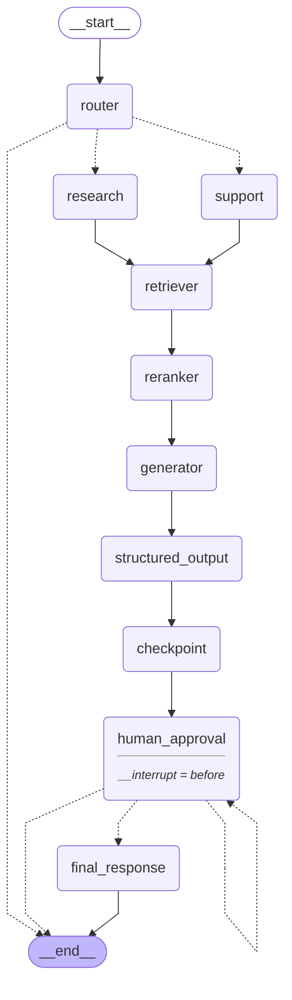

# Agentic Workflow — Graph Documentation

Auto-generated by `app/graph/visualization.py`.
Re-run `python -m app.graph.visualization --save` after any graph change.

---

## Mermaid Diagram

---

## Node Reference

+-------------------+--------------+-----------------------------------------------------------------------+
| Node              | Backend      | Responsibility                                                        |
+-------------------+--------------+-----------------------------------------------------------------------+
| START             | —            | Entry point for every workflow run                                    |
| router            | LLM          | Classifies query → research | support                                 |
| research          | pass-through | Marks the research execution path                                     |
| support           | pass-through | Marks the support execution path                                      |
| retriever         | ChromaDB     | Fetches top-10 chunks by semantic similarity                          |
| reranker          | CrossEncoder | Re-scores chunks with BAAI/bge-reranker-large, keeps top-3            |
| generator         | LLM          | Produces summary + answer + citations (ResearchAgent or SupportAgent) |
| structured_output | Pydantic     | Validates draft JSON → StructuredOutput TypedDict                     |
| checkpoint        | PostgreSQL   | Writes audit record to workflow_checkpoints table                     |
| human_approval    | interrupt ⏸  | Graph pauses here; resumes after reviewer decision                    |
| final_response    | pure         | Assembles FinalResponse TypedDict from approved output                |
| END               | —            | Workflow terminal state                                               |
+-------------------+--------------+-----------------------------------------------------------------------+

---

## Execution Paths

Research path
─────────────
1.  User submits a query via POST /api/v1/workflow.
2.  router       → LLM classifies intent as "research".
3.  research     → path is marked; query may be enriched.
4.  retriever    → top-10 chunks fetched from ChromaDB.
5.  reranker     → CrossEncoder re-scores, top-3 kept.
6.  generator    → ResearchAgent calls Ollama; produces structured JSON.
7.  structured_output → JSON validated against Pydantic schema.
8.  checkpoint   → audit record written to PostgreSQL.
9.  human_approval → graph PAUSES (interrupt_before).
10. Reviewer calls POST /api/v1/workflow/{id}/approve.
11. human_approval (resumed) → logs decision.
12. final_response → FinalResponse assembled.
13. Client calls GET /api/v1/workflow/{id}/result.

Support path
────────────
Steps 1–5 identical.
6.  generator    → SupportAgent performs confidence triage:
                   • high confidence: answers directly (no citations)
                   • low confidence:  uses retrieved documents
Steps 7–13 identical.

Error / rejection paths
───────────────────────
•  router failure  → errors list populated → conditional edge routes to END.
•  reviewer rejects → approval_status = "rejected" → conditional edge routes to END.
